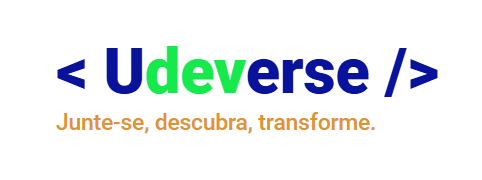

# UDEVERSE
Projeto pessoal desenvolvido para consolidar os conhecimentos adquiridos durante os três módulos do curso de Desenvolvimento de Sistemas: Front-End, Back-End e Banco de Dados. Este projeto funciona como uma rede social - de forma bem simplificada - com as funcionalidades básicas exigidas por esse tipo de site/aplicativo.

## Linguagens Utilizadas

## Funcionalidades
- Cadastro de Usuários com sistema de autenticação;
- Inserção de posts na plataforma;
- Curtida e comentários nos posts.